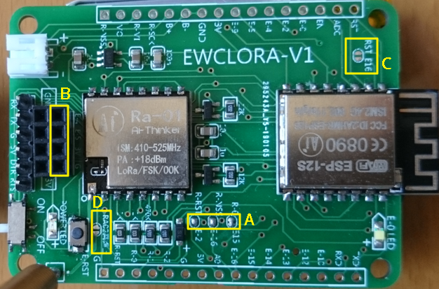
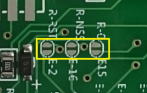
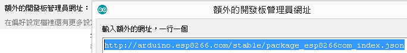
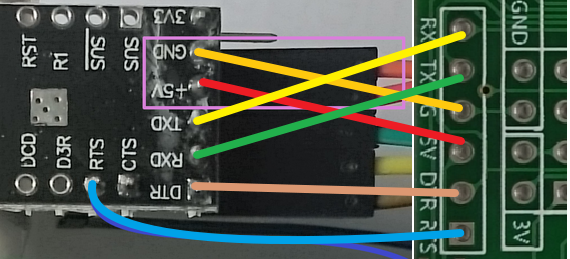

# EWCLORA-V1 開發板使用指南 #

----------

## 開發板概述： ##
此塊開發板，主要使用安信可的開發模組，可自行選擇**ESP-07S**、**ESP-12S**、**ESP-01M**，並將LoRa傳輸整合進來，LoRa可選擇**Ra-01**或**Ra-02**模組，將WiFi與LoRa整合在一起，可成為LoRa的網關，此LoRa的傳輸有WiFi的五倍甚至更遠，對遮蔽物的穿透效果比WiFi高出許多，可應用於LoRa資料收集並轉到網際網路應用，ESP8266可以使用Arduino IDE進行開發，這個專案的實作，採用了ESP-01M與ESP-12S兩種MCU作為硬件開發，傳送並接收LoRa訊號，可測得並顯示LoRa的訊號強弱，以下就開始說明整個專案的實作過程。

## 模組配件： ##
準備的硬件包含以下模組，依各自的需求，選擇合適的模組應用。

- **[EWCLORA-V1 開發板](https://goods.ruten.com.tw/item/show?21902542088988 "EWCLORA-V1開發板")** 
如果不使用 **EWCLORA-V1** 開發板，也可以自行選擇ESP8266相關開發板，此開發板只是方便的將ESP與LORA整合一塊，不需再連接一堆線路， **EWCLORA-V1** 開發板除了連接LoRa模組外，還可直接使用OLED顯示屏幕，並內建自動下載電路，所以使用TTL接上電腦的USB後，就可以直接上傳燒錄，不再需要手動進入燒錄模式，且電源可以使用6V~3.3V供電。

- **[ESP-12S 或 ESP-01M](https://goods.ruten.com.tw/item/show?21851264891849)** 
可任選其一，此V1開發板選擇這兩種模組都可以用，差別在於ESP-12S內建4M Flash RAM，ESP-01M內建只有1M Flash RAM，且ESP-01M使用ESP8285核心蕊片，可由ESP8266無縫移植。

- **[Ra-01 或 Ra-02](https://goods.ruten.com.tw/item/show?21902557405314)** 
此專案採用的LoRa模組，Ra-01用的是彈簧天線，Ra-02用的是外接天線，此模組不需要開發，直接由ESP8266的SPI協定進行通訊，在實測中，此LoRa模組在無障礙的環境中，可收發的距離能超過1公里，很適合應用在少量數據的遠距傳輸。

- **[CP2102 USB 轉 TTL](https://goods.ruten.com.tw/item/show?21516047508043)** 
這裡使用CP2102上傳模組，也可以使用其他的USB轉TTL模組，只要模組上有 **DTR** 與 **RTS** 接腳，就可以使用自動上傳的功能，

- **0.96 吋 OLED 單色顯示屏幕** 
使用3.3V版本的OLED單色顯示屏幕，不用接線，可直插開發板上，直接顯示當前的收發狀況。
- **電池與充電模組** 
供電方式可以選擇USB、1顆18650、3顆三號或四號電池等等多種供電方式，此專案使用3.7V鋰電池，還可以外接充電模組進行充電。

## 開發板硬體說明： ##
**EWCLORA-V1** 開發板上，可裝上ESP8266、ESP8285與LORA模組外，還可接上OLED顯示屏幕，板上正反面都有電源接口，輸入的直流電壓為 **6V~3.5V** ，也可直接輸入3.3V到3V的接孔上，開發板的 **A0** PIN 腳可直接接入 0~5V 電平，由ESP程式的 `analogRead(A0)` 進行電壓讀取，板上接的ESP-12S或ESP-01M模組，引腳已全部引出，編號從 E-0 ~ E-16 對應 IO0 ~ IO16 ， Ra-01 或 Ra-02 只有部分引腳引出，以下針對黃色框框的部分，標示說明開發板的功能使用。

> 

- **[標示A] - ESP與LORA的通訊連接** 
這有三個接點用於連接ESP與LoRa模組，分別將ESP模組的 GPIO 2、15、16接到LORA模組的 NRESET、DIO0、NSS，如果沒有連接，也可以自己使用杜邦線來決定使用不同的 ESP IO 引腳，兩個模組使用了 **SPI** 的通訊協定進行溝通。 

- **[標示B] - OLED顯示屏模組** 
可直接在圖上B處插上 4 PIN 的OLED模組，使用時，**注意OLED電源正負號接腳**即可，此OLED使用I2C的通訊協定作業。

- **[標示C] - ESP的休眠功能** 
當需要使用ESP的休眠功能時，可以焊上此接點，程式使用 `ESP.deepSleep(60000)` ，讓ESP休眠1分鐘。

- **[標示D] - Ra02外接天線選項** 
當使用Ra02模組的外接天線時，可以連接此點，使ANT變成GND接地使用，一般不需要連接，當用Ra-01模組時，使用ANT接腳連接彈簧天線即可。

## 軟件燒錄： ##
在軟件開發上，以Arduino IDE開發為例，安裝操作步驟如下。

1. 下載 Arduino IDE 開發工具並進行安裝 
下載路徑[https://www.arduino.cc/en/Main/Software](https://www.arduino.cc/en/Main/Software "Arduino IDE")，個人喜歡使用 Windows 免安装ZIP包，直接下載解壓縮就可以執行使用。

2. 維護偏好設定，安裝ESP8266開發板 
在偏好設定中，維護ESP開發板管理路徑"http://arduino.esp8266.com/stable/package_esp8266com_index.json"，維護後到 **工具/開發板/開發板管理員** ，尋找ESP8266下載安裝，安裝後就可以選擇ESP8266或ESP8285開發板進行開發作業。

3. 安裝LORA程式庫與OLED程式庫 
可下載 [arduino-LoRa 程式庫](https://github.com/cypswu/arduino-LoRa "arduino-LoRa Library") 與 [Adafruit_SSD1306 程式庫](https://github.com/cypswu/Adafruit_SSD1306 "OLED Library") ，也可以到原始項目(forked from)中下載最新版本的庫，然後於 **草稿碼/匯入程式庫**，將程式庫匯入。

4. 編寫開發程式 
完成後就可以開始開發此專案，完整的程式碼已在[EWC_LoRaSample](https://github.com/cypswu/ewclora-v1/blob/master/EWC_LoRaSample/EWC_LoRaSample.ino "EWC_LoRaSample.ino")中，可依需求自行修改。

5. 上傳開發程式 
上傳開發程式需要將開發板連接USB轉TTL模組，上傳後就可以拔除USB轉TTL模組並獨自運作，由於EWCLORA開發板已內建自動下載電路，所以連接PC後，不需要將ESP的IO0接地，只需要燒錄的**Reset Method**設置為**nodemcu**模式，就可以自動上傳，EWCLORA開發板與USB轉TTL的連接方式如下圖所示。 

### 參考資訊： ###
[**EWCLORA-V1開發板**](https://goods.ruten.com.tw/item/show?21902542088988 "EWCLORA-V1開發板")可以在[這裡](https://goods.ruten.com.tw/item/show?21902542088988 "EWCLORA-V1開發板")找到，模組配件連結僅供參考，對於焊接電子元件不熟時，建議可以請店家幫忙把需求的組件焊接完成，當收到後就可以直接使用。

----------

> ESP-12S 使用的燒錄配置選項

> ESP-12S 使用的燒錄配置選項

> 開發板正面圖

> 開發板背面圖

> 開發板連接USB轉TTL的連接方式。

> 兩組開發板相互收發，顯示屏幕上可得知開發板的隨機編號(0x??)，傳送(Tx)與接收(Rx)的次數，下次傳送與接收的間隔時間，RSSI是接收的訊號強度，為負數值，距離越遠數值越小。

> 完成組件的正面與背面狀態，背面連接一顆鋰電池獨自運行。

> 使用 ESP-12S 搭配 Ra-01 ，並接上彈簧天線

> 使用 ESP-01M 與 Ra-02 的外接天線，並連接18650充電模組，可對背面連接的鋰電池進行充電。
