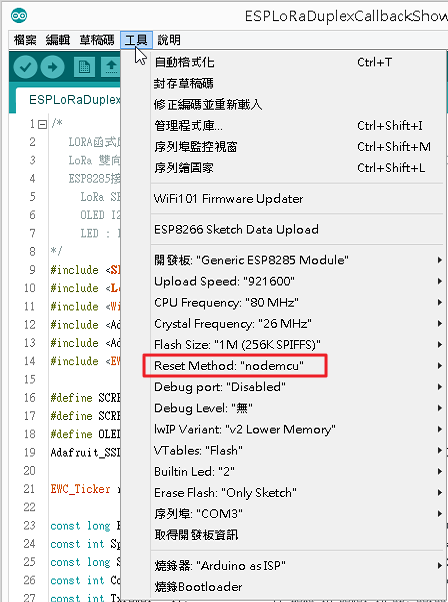

## EWCLORA-V1開發板使用指南 ##

### 開發板概述： ###
此開發板能主要使用安信可的開發模組，可自行選擇**ESP-07S**、**ESP-12S**、**ESP-01M**，並將LoRa傳輸整合進來，LoRa可選擇**Ra-01**或**Ra-02**模組，將WiFi與LoRa整合在一起，可成為LoRa的網關，此LoRa的傳輸有WiFi的五倍甚至更遠，對遮蔽物的穿透效果比WiFi高出許多，可應用於LoRa資料收集並轉到網際網路應用，ESP8266可以使用Arduino IDE進行開發，這個範例實際採用了ESP-01M與ESP-12S為硬件開發，傳送並接收LoRa訊號，測得LoRa的訊號強弱，以下就開始說明整個實作過程。

### 模組配件： ###
準備的組件包含以下模組，依其需求選擇合適的模組應用。

- **EWCLORA-V1開發板** 
如果不使用EWCLORA-V1開發板，也可以自行使用ESP8266相關開發板，如此需與La-01模組自行接線，此開發板除了連接LoRa模組外，還可直接使用OLED顯示屏幕，並內建自動下載電路，所以使用TTL接上電腦的USB後，就可以直接上傳燒錄，不再需要手動進入燒錄模式，且電源可以使用6V~3.3V供電。
- **ESP-12S 或 ESP-01M** 
可任選其一，此V1開發板選擇這兩種模組都可以用，差別在於ESP-12S內建4M Flash RAM，ESP-01M內建只有1M Flash RAM，且使用ESP8285核心蕊片，可由ESP8266無縫移植。
- **Ra-01 或 Ra-02** 
此專案使用的LoRa模組，Ra-01用的是彈簧天線，Ra-02用的是外接天線，此模組不需要燒錄，直接由ESP8266的Soft Serial進行通訊，在實測中，此LoRa模組在無障礙的環境中，可收發的距離能超過1公里，很適合應用在少量數據的遠距傳輸。
- **CP2102 USB 轉 TTL** 
這裡使用CP2102上傳模組，也可以使用其他的USB轉TTL模組，只要模組上有 **DTR** 與 **RTS** 接腳，就可以使用自動上傳的功能，
- **0.96 吋 OLED 單色顯示屏幕** 
使用3.3V版本的OLED單色顯示屏幕，不用接線，可直插開發板上，直接顯示當前的收發狀況。
- **電池與充電模組** 
供電方式可以選擇USB、1顆18650、3顆三號或四號電池等等多種供電方式，此專案使用3.7V鋰電池，還可以外接充電模組進行充電。

### 開發板硬體說明： ###

### 軟件燒錄： ###

### 參考資訊： ###
[EWCLORA-V1開發板](https://goods.ruten.com.tw/item/show?21902542088988 "EWCLORA-V1開發板")可以在[這裡](https://goods.ruten.com.tw/item/show?21902542088988 "EWCLORA-V1開發板")找到。

